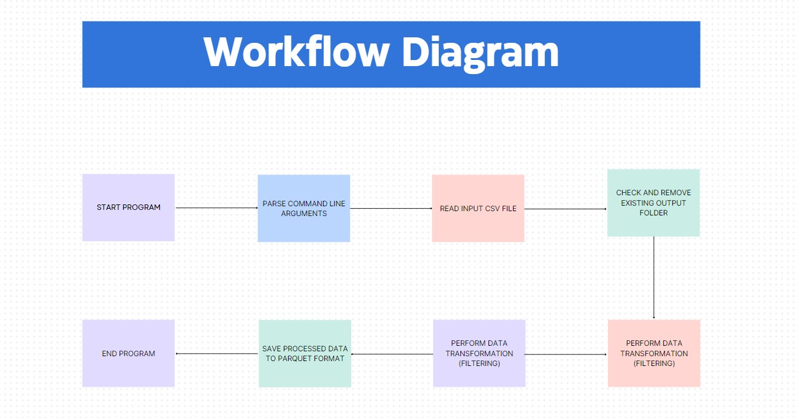

Description:

--> This repository represents "Data processing pipeline for parking violations data.

-->with the help of this project we can backfill the missing data in the pipeline.

Dataset

-->Download the dataset from the kaggle website
https://www.kaggle.com/new-york-city/ny-parking-violations-issued?select=parking-violations-issued-fiscal-year-2018.csv

Requirements:

1.Python
2.git
3.docker
4.pyarrow
5.fastparquet

Flowchart

Here's a diagram of the high level pipeline design for this pattern:

